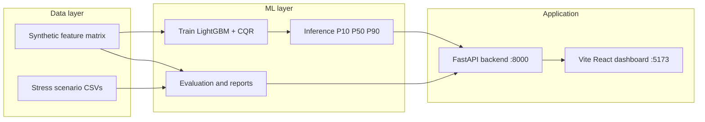
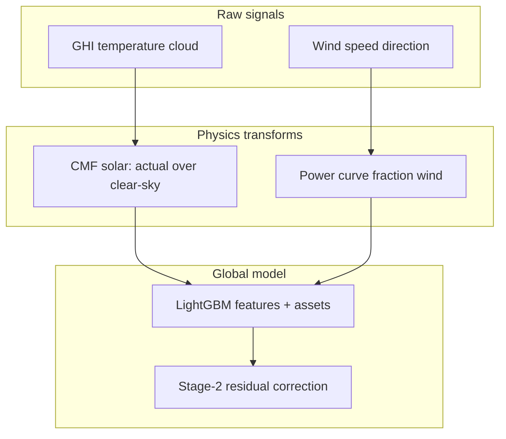
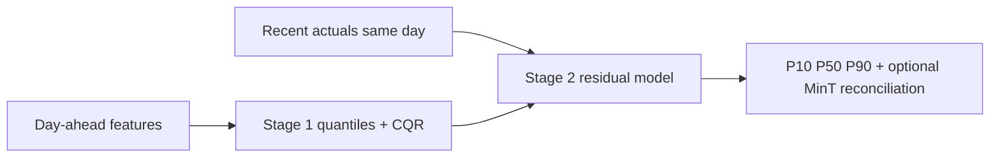
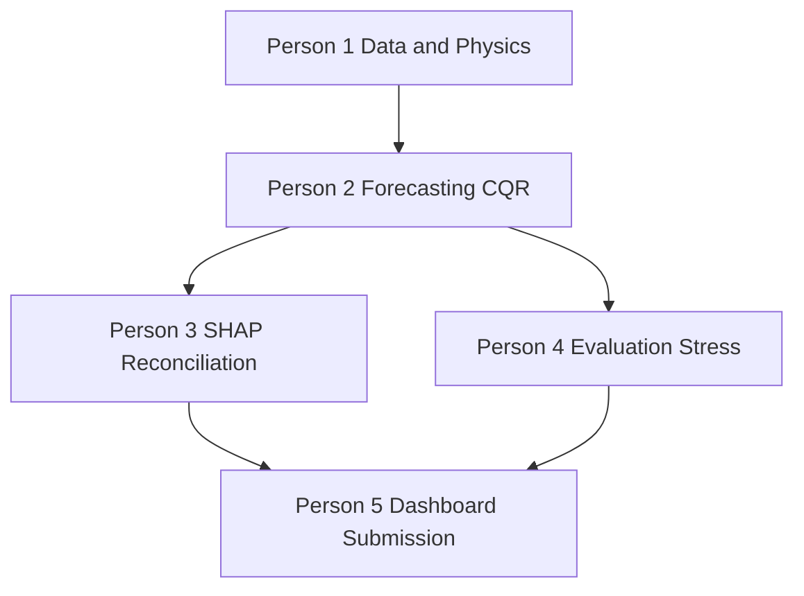

# UrjaDrishti — KREDL / KSPDCL Renewable Forecasting

UrjaDrishti is an **AI-enabled forecasting system** for Karnataka renewable generation. It sits on top of existing SCADA-style data flows **without modifying legacy systems**: forecasts and uncertainty are served to operators through a **FastAPI backend** and a **React (Vite) dashboard**.

**What you get**

- Plant and cluster forecasts with **P10 / P50 / P90** (80% prediction intervals)
- **Explainability** (SHAP-driven signals mapped to operator-facing alerts)
- **Evaluation** (baselines, holdout metrics, stress scenarios, report artifacts)
- Dashboard areas: **Plant**, **Cluster**, **Evaluation**, **Logbook**, **War Room**
- **English / Kannada** UI where implemented

**Problem in one sentence:** Solar and wind output swing with weather and asset physics; operators need **accurate point forecasts**, **honest uncertainty**, and **plain-language drivers**—on-premise, without cloud-hosted training or inference on sensitive data.

---

## Architecture (high level)



**Runtime URLs (after `start.sh` / `start.bat`)**

| Service | URL | Notes |
|--------|-----|--------|
| **Frontend (dashboard)** | http://localhost:5173 | Vite dev server |
| **Backend (REST API)** | http://localhost:8000 | FastAPI (`uvicorn`) |
| **OpenAPI / Swagger** | http://localhost:8000/docs | Interactive API docs |

The dashboard talks to the backend over HTTP; keep both processes running for a full demo.

---

## Data and physics (conceptual)



- **Data:** Synthetic hourly history (Gaussian Copula–style multivariate series) mimicking Karnataka portfolio behaviour; **six plants**, **two clusters**; separate **stress** CSVs (cloud ramp, monsoon onset, wind spike, low irradiance)—evaluation only, not training.
- **Solar:** **Cloud Modification Factor (CMF)** = actual GHI / clear-sky GHI (bounded, season-stable).
- **Wind:** Hub-relevant wind passed through a **turbine power curve** so the model learns residuals, not the full nonlinear speed-to-power map.
- **Uncertainty:** **Conformalized Quantile Regression (CQR)** via MAPIE on top of quantile LightGBM models—target **~80% empirical coverage** for the P10–P90 band on holdout data.

---

## Forecasting stack (two stages)



- **Stage 1:** Global LightGBM across plants (asset encodings distinguish plants); outputs median and raw quantiles; **CQR** calibrates intervals.
- **Stage 2:** Uses recent forecast errors (e.g. last hours) to **correct** remaining hours for intra-day-style updates.
- **Reconciliation (Person 3):** **MinT** can align plant vs cluster totals so dashboards stay numerically consistent.

---

## Prerequisites

- **Python 3.10+** (3.11 / 3.12 recommended)
- **Node.js** LTS (18+ recommended) and **npm**
- **Git**
- **uvicorn** is pulled in via `backend/requirements.txt` (used to serve the API on port **8000**)

---

## One-command startup

From the **repository root**:

### macOS / Linux

```bash
bash start.sh
```

### Windows (CMD)

```bat
start.bat
```

### What the scripts do (aligned with `start.sh` / `start.bat`)

1. **Backend environment** — Create `backend/venv` if needed, activate it, `pip install -r backend/requirements.txt`.
2. **Forecasting models** — `PYTHONPATH=<backend> python -m src.ml.forecasting.main` (trains / refreshes `kredl_stage1.pkl`, `kredl_stage2.pkl`).
3. **Evaluation** — Runs, in order:
   - `python -m src.ml.evaluation.test_baselines`
   - `python -m src.ml.evaluation.test_harness`
   - `python -m src.ml.evaluation.run_stress_evaluation`
   - `python -m src.ml.evaluation.run_day5_report`  
   (working directory must be `backend` with `PYTHONPATH` set; the scripts do this for you.)
4. **Backend server** — `uvicorn src.main:app --reload --port 8000` → **http://localhost:8000** (Swagger at **`/docs`**).
5. **Frontend** — `npm install` and `npm run dev` in `frontend/` → **http://localhost:5173**.

On **macOS/Linux**, `start.sh` runs backend and frontend in the background and waits on the frontend; **Ctrl+C** stops both (see `trap` in the script).

On **Windows**, `start.bat` opens **separate** terminal windows for uvicorn and Vite; you can close the launcher window after success.

---

## What success looks like in the terminal

You should see progress for **[1/5] … [5/5]** and messages such as:

- `Backend environment ready.`
- `Evaluation completed.` (after all four evaluation modules finish)
- `SYSTEM READY`
- `Dashboard: http://localhost:5173`
- `API docs:  http://localhost:8000/docs` (printed by `start.sh`; `start.bat` prints the same URLs)

On the frontend process you should also see Vite **ready** and **Local: http://localhost:5173/**.

If any step fails, **fix that step first** (missing Python/npm, pip errors, missing `data/` files, etc.); both startup scripts are written to **fail fast** on model or evaluation errors where `set -e` / `exit /b 1` applies.

---

## Generated outputs (where to look)

### Evaluation report artifacts

`backend/src/ml/evaluation/reports/`

- `comparison_table.csv`
- `quantile_calibration_points.csv`
- `season_stratified_table.csv`
- `sharpness_summary.csv`
- `evaluation_section.md`

### Stress evaluation plots / tables

`data/evaluation_plots/`

- `stress_metrics_summary.csv`
- `cloud_ramp_interval_width.png`
- `monsoon_onset_interval_width.png`
- `wind_spike_width_vs_wind.png`
- `calm_vs_stress_interval_width.png`
- `quantile_reliability.png` (when produced by the reporting flow)

### Trained model binaries

- `backend/src/ml/forecasting/kredl_stage1.pkl`
- `backend/src/ml/forecasting/kredl_stage2.pkl`

---

## Frontend verification checklist

With **backend (8000)** and **frontend (5173)** running, open **http://localhost:5173** and check:

- **Plant:** forecast ribbon (P10/P50/P90), confidence band, explainability alerts
- **Cluster:** reconciliation behaviour and stacked / aggregate views
- **Evaluation:** metrics table, forecast ledger, model health where wired
- **Logbook:** add / search / filter entries
- **War Room:** fullscreen-style monitor if enabled
- **Language:** English / Kannada toggle where implemented

---

## 🚀 Deploy to Railway

Ready to deploy? Follow our quick deployment guide:

### Quick Deploy (5 minutes)
1. Push to GitHub
2. Run `railway login && railway up`
3. Set environment variables in Railway dashboard
4. Your app is live!

📖 **Full Guide:** [RAILWAY_DEPLOYMENT.md](./RAILWAY_DEPLOYMENT.md)

**Quick Links:**
- 🚀 [Quick Start](./QUICKSTART_RAILWAY.md)
- 📖 [Detailed Guide](./RAILWAY_DEPLOYMENT.md)
- 🔗 [Railway Docs](https://docs.railway.app/)

---

## Manual run (if you do not use `start.sh` / `start.bat`)

All commands assume repo root unless noted.

### Backend: train models only

```bash
cd backend
python -m venv venv
source venv/bin/activate   # Windows: venv\Scripts\activate
python -m pip install -r requirements.txt
PYTHONPATH=. python -m src.ml.forecasting.main
```

### Backend: API server (required for dashboard API calls)

```bash
cd backend
source venv/bin/activate
PYTHONPATH=. uvicorn src.main:app --reload --port 8000
```

Open **http://localhost:8000/docs** to inspect routes.

### Backend: evaluation only (after models exist)

```bash
cd backend
source venv/bin/activate
PYTHONPATH=. python -m src.ml.evaluation.test_baselines
PYTHONPATH=. python -m src.ml.evaluation.test_harness
PYTHONPATH=. python -m src.ml.evaluation.run_stress_evaluation
PYTHONPATH=. python -m src.ml.evaluation.run_day5_report
```

### Frontend only

```bash
cd frontend
npm install
npm run dev
```

Point the frontend’s API base URL to **http://localhost:8000** if your build uses an env variable (see `frontend` config if requests fail).

---

## Team and contributions



| Person | Name | Focus |
|--------|------|--------|
| **Person 1** | Bhavya Garg | Synthetic data, physics features, stress scenario generators |
| **Person 2** | Naman Bhandari | Global LightGBM, two-stage forecasts, MAPIE CQR |
| **Person 3** | Surya Kiran Basava | SHAP explainability, alerts, MinT reconciliation |
| **Person 4** | Manvik Kumar Gupta | Holdout evaluation, baselines, stress validation, reports |
| **Person 5** | Arush Kumar Jain | React dashboard, integration, demo and submission packaging |

---

## Roadmap (not in this repo prototype)

Production narrative includes **spatio-temporal graph models** for weather propagation across plants and an **on-premise small language model** for richer alerts. The current hackathon path is **LightGBM + CQR + templates + MinT**, which is enough to demonstrate end-to-end value and evaluation discipline.

---

## License / data notice

Training uses **synthetic** Karnataka-like data. **No real SCADA** is bundled; deployment assumptions (on-prem, no cloud inference on sensitive data) are design goals described in team documentation.
